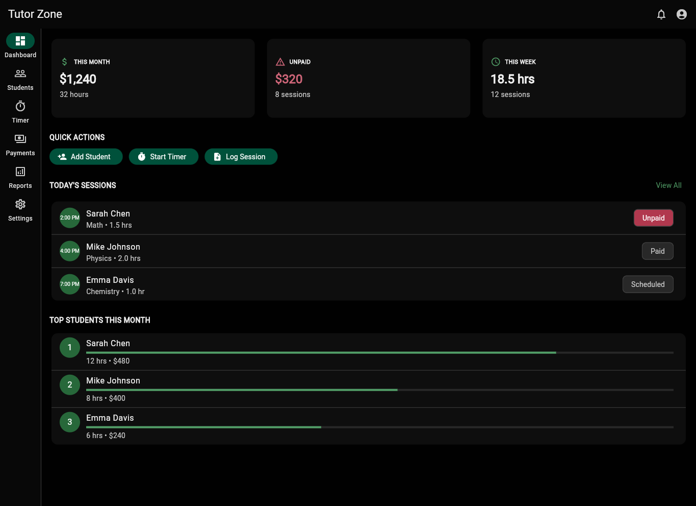
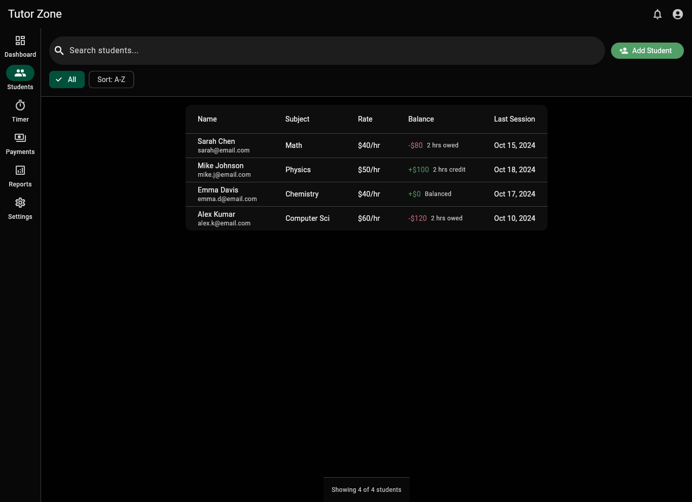
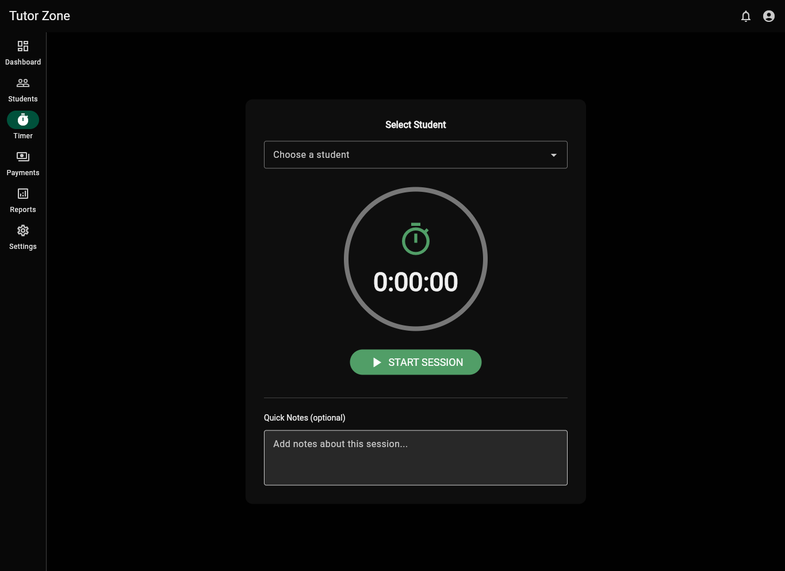
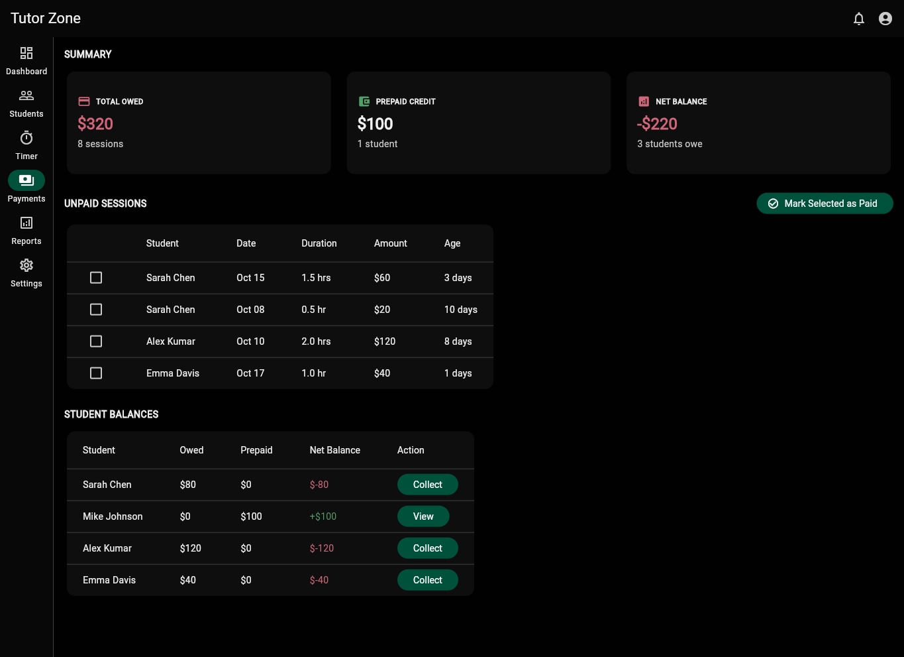
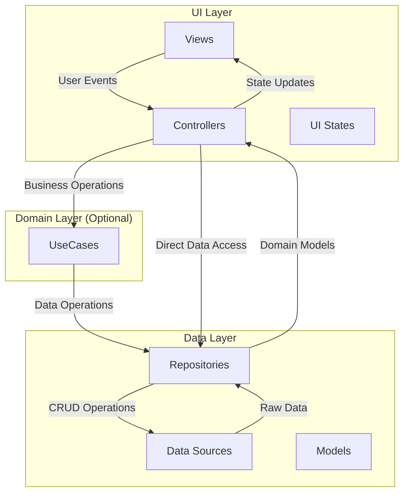
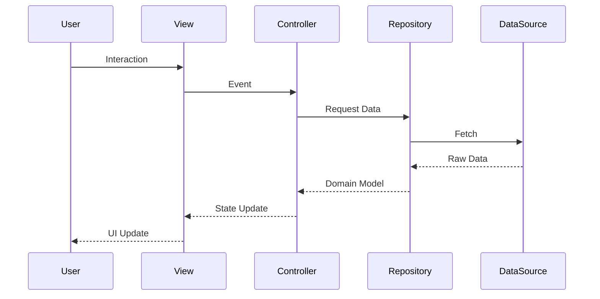

# TutorZone

A Flutter application for tutors to manage students, track teaching sessions, and monitor payments.

## Overview

TutorZone helps tutors organize their teaching business by tracking student information, logging sessions, calculating earnings, and managing payments — all in one place.

### App Preview

<table>
  <tr>
    <td width="25%">
      
      <p align="center"><b>Dashboard</b><br/>Track earnings, hours, and upcoming sessions</p>
    </td>
    <td width="25%">
      
      <p align="center"><b>Students</b><br/>Manage student profiles and balances</p>
    </td>
    <td width="25%">
      
      <p align="center"><b>Timer</b><br/>Track sessions with built-in timer</p>
    </td>
    <td width="25%">
      
      <p align="center"><b>Payments</b><br/>Monitor payments and student balances</p>
    </td>
  </tr>
</table>

## Core Features (MVP – Minimum Viable Product)

### 1. Student Management
- Add/Edit student profiles (name, contact, subject)
- Hourly rate per student
- Notes (e.g., topics covered, learning goals)

### 2. Session Tracking
- Log each session (date, start–end time, duration)
- Auto-calculate total hours per session
- Add notes per session (e.g., "Worked on Python casting exercises")

### 3. Payment & Balance
- Mark session as Paid or Unpaid
- Student balance tracker (e.g., prepaid hours vs. owed hours)
- View monthly summary (total hours, total income, outstanding)

### 4. Time Tracking (optional first feature)
- Built-in timer (Start → Stop → Save session)
- Option to manually enter session duration

### 5. Analytics Dashboard (later feature)
- Total hours taught this month
- Income summary
- Top students by hours
- Trends chart (hours/week)

## Flutter Architecture Components

A scalable Flutter application architecture based on MVC pattern with Riverpod state management, following clean architecture principles.

For detailed information about this architecture, see [architecture.pdf](doc/architecture.pdf).

### Architecture Overview

This architecture implements a layered approach with unidirectional data flow (UDF), ensuring maintainability, testability, and scalability.



### Core Principles

- **Separation of Concerns**: Each layer has distinct responsibilities
- **Single Source of Truth (SSOT)**: Data flows from repositories
- **Unidirectional Data Flow (UDF)**: Events flow down, data flows up
- **Immutable State**: All state objects are immutable using Freezed

### Project Structure

```
lib/
├── src/
│   ├── core/           # Core utilities, constants, themes
│   ├── features/       # Feature-based organization
│   │   └── students/   # Example feature
│   │       ├── controllers/
│   │       ├── models/
│   │       │   ├── data/
│   │       │   ├── data_sources/
│   │       │   └── repositories/
│   │       └── views/
│   │           ├── screens/
│   │           ├── ui_states/
│   │           └── widgets/
│   └── domain/         # Optional business logic layer
│       └── use_cases/
└── main.dart
```

### Layer Responsibilities

#### UI Layer

**Views (Screens & Widgets)**
- Display data on screen
- Capture user interactions
- Stateless whenever possible
- No business logic in build methods
- Reactive UI: `UI = f(state)`

**UI States**
- Immutable state objects using Freezed
- Contains UI-specific state (selections, filters, form data)
- Does NOT contain loading/error states (handled by AsyncValue)

```dart
@freezed
class StudentListState with _$StudentListState {
  const factory StudentListState({
    @Default([]) List<String> selectedIds,
    @Default('') String searchQuery,
    @Default(SortType.name) SortType sortType,
  }) = _StudentListState;
}
```

**Controllers**
- Handle user interactions
- Manage UI state
- Coordinate with repositories
- Use Riverpod providers for state management

#### Data Layer

**Repositories**
- Orchestrate between data sources
- Expose streams and futures
- Business logic implementation
- Single source of truth for data
- Return immutable domain models

**Data Sources**
- Interface with external data (API, database, files)
- One data source per external service
- Simple CRUD operations only
- No business logic

#### Domain Layer (Optional)

**Use Cases**
- Complex business logic that spans multiple repositories
- Reusable business operations
- Examples: `CalculateSessionEarningsUseCase`, `GetMonthlyReportUseCase`

### State Management Pattern

Using Riverpod with AsyncValue for data fetching:



### Example Implementation (Riverpod Code Generation)

**1. Data Provider (AsyncValue handles loading/error)**

```dart
@riverpod
Future<List<Student>> students(StudentsRef ref) async {
  final repository = ref.watch(studentRepositoryProvider);
  return repository.getStudents();
}
```

**2. UI State Provider**

```dart
@riverpod
class StudentListController extends _$StudentListController {
  @override
  StudentListState build() => const StudentListState();

  void setSearchQuery(String query) {
    state = state.copyWith(searchQuery: query);
  }

  void toggleSelection(String id) {
    final selected = state.selectedIds.contains(id)
        ? state.selectedIds.where((s) => s != id).toList()
        : [...state.selectedIds, id];
    state = state.copyWith(selectedIds: selected);
  }
}
```

**3. Computed Provider**

```dart
@riverpod
List<Student> filteredStudents(FilteredStudentsRef ref) {
  final studentsAsync = ref.watch(studentsProvider);
  final uiState = ref.watch(studentListControllerProvider);

  return studentsAsync.maybeWhen(
    data: (students) => _filterAndSort(students, uiState),
    orElse: () => [],
  );
}
```

**4. Screen Implementation**

```dart
class StudentListScreen extends ConsumerWidget {
  @override
  Widget build(BuildContext context, WidgetRef ref) {
    final studentsAsync = ref.watch(studentsProvider);

    return studentsAsync.when(
      data: (students) => _buildList(students),
      loading: () => CircularProgressIndicator(),
      error: (err, stack) => ErrorWidget(err.toString()),
    );
  }
}
```

### Key Benefits

- **Testability**: Each layer can be tested independently
- **Maintainability**: Clear separation of concerns
- **Scalability**: Feature-based folders make scaling easy
- **Type Safety**: Freezed + Riverpod provide compile-time safety
- **Reactive**: Automatic UI updates when data changes

### Best Practices

- **Feature Folders**: Organize by feature, not by type
- **Immutable State**: Always use Freezed for state objects
- **AsyncValue**: Let Riverpod handle loading/error states
- **Computed Providers**: Use for derived state (filtering, sorting)
- **Repository Pattern**: Abstract data sources from business logic
- **Single Responsibility**: Each class should have one reason to change
- **Code Generation**: Use Riverpod's `@riverpod` annotation for type-safe providers
# tutor_zone
